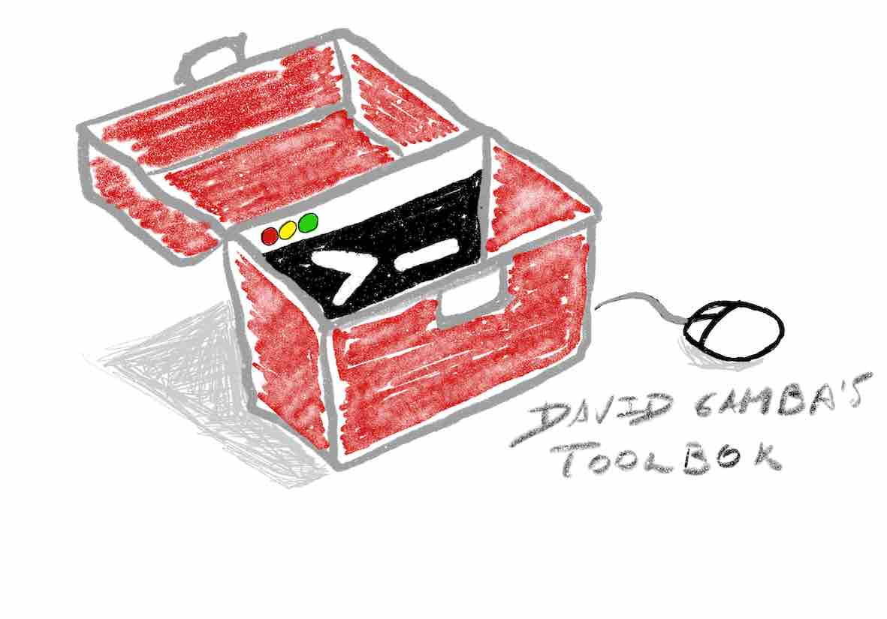

= David Gamba's Toolbox image:https://github.com/DavidGamba/dgtools/actions/workflows/tests.yml/badge.svg[link="https://github.com/DavidGamba/dgtools/actions"]

 +
A monorepo filled with goodies.

----
Untagged tools/libs will not be maintained for public consumption (at least initially).
----

== Index of Libraries

image:https://pkg.go.dev/badge/github.com/DavidGamba/dgtools/buildutils.svg[Go Reference, link="https://pkg.go.dev/github.com/DavidGamba/dgtools/buildutils"] link:buildutils[] - Provides functions used when writing build automation.

image:https://pkg.go.dev/badge/github.com/DavidGamba/dgtools/fsmodtime.svg[Go Reference, link="https://pkg.go.dev/github.com/DavidGamba/dgtools/fsmodtime"] link:fsmodtime[] - Provides functions to determine if you want to build targets from sources based on modification time.

image:https://pkg.go.dev/badge/github.com/DavidGamba/dgtools/run.svg[Go Reference, link="https://pkg.go.dev/github.com/DavidGamba/dgtools/run"] link:run[] - Provides a wrapper around os/exec with method chaining for modifying behaviour.

image:https://pkg.go.dev/badge/github.com/DavidGamba/dgtools/password-cache.svg[Go Reference, link="https://pkg.go.dev/github.com/DavidGamba/dgtools/password-cache"] link:password-cache[] - Cache credentials using the Linux keyring in Go.

image:https://pkg.go.dev/badge/github.com/DavidGamba/dgtools/clitable.svg[Go Reference, link="https://pkg.go.dev/github.com/DavidGamba/dgtools/clitable"] link:clitable[] - Pretty print Data as tables on the command line.

image:https://pkg.go.dev/badge/github.com/DavidGamba/dgtools/cueutils.svg[Go Reference, link="https://pkg.go.dev/github.com/DavidGamba/dgtools/cueutils"] link:cueutils[] - Provides helpers to work with CUE files.

== Index of Tools

link:bt[] - A no commitments Terraform wrapper that provides build caching functionality.
It also makes working with workspaces a breeze.

link:cli-bookmarks[] - yet another tool to bookmark filesystem locations and access them in a fast and easy way.

link:diffdir[] - Wrapper around `git diff --no-index` to diff 2 directories.

link:ffind[] - Fast Regex Find, faster common Find searches using the power of Golang’s Regex engine.

link:grepp[] - An improved version of the most common combinations of grep, find and sed/perl, in a single tool.

link:joinlines[] - Simple utility to join lines from a cli command output.

link:kdecode[] - Decodes K8s secret's data block.

link:mermaid[] - Mermaid diagrams CLI.

link:password-cache[] - Cache credentials using the Linux keyring in Go.

link:tz[] - Show time zones based on user defined groups.

link:yaml-parse[] - Parse and extract data from YAML files.

link:reverseproxy[] - Creates a very simple reverse proxy that allows to proxy multiple local services at different base paths dynamically with CLI args.

link:clitable[csvtable] - Pretty print csv input as a table.

=== Homebrew

Some tools are published with homebrew:

----
brew tap DavidGamba/dgtools https://github.com/DavidGamba/dgtools
brew search DavidGamba/dgtools
brew install --HEAD DavidGamba/dgtools/<tool>
----

Upgrade with:

----
brew update
brew reinstall <tool>
----

Bash completions are installed by default.

For `zsh` completions, an additional step is required, add the following to your `.zshrc` per tool:

[source, zsh]
----
export ZSHELL="true"
source "$(brew --prefix)/share/zsh/site-functions/dgtools.<tool>.zsh"
----
