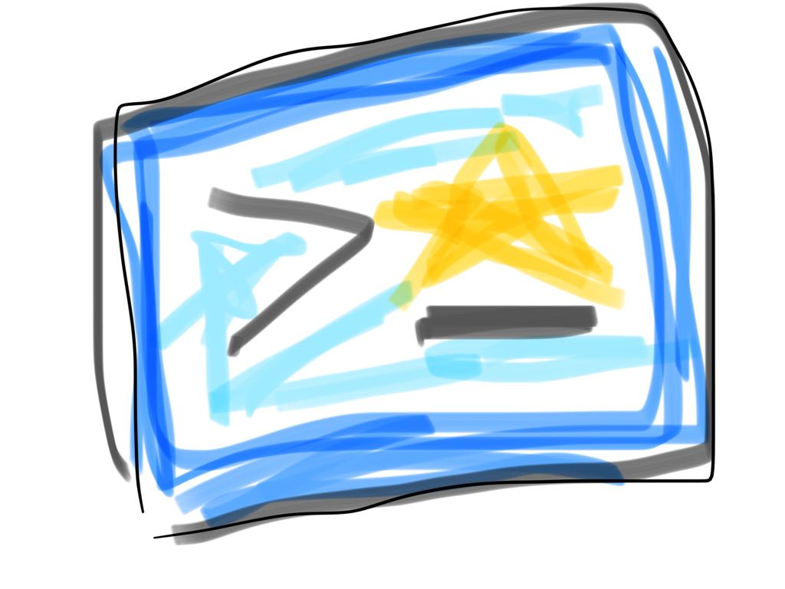

=  cli-bookmarks: CLI Filesystem Directory Bookmarks

cli-bookmarks is yet another tool to bookmark filesystem locations and access them in a fast and easy way.

Features:

* Easy bash completion setup.
The completions are generated by the tool in a high level language, not in bash.

* Both termbox based UI and CLI only modes.

* Bookmarks are stored on an easy to edit toml file.

== SYNOPSIS

+#+ Show the GUI +
*cb*

+#+ Use a bookmark +
*cb* _bookmark_alias_

+#+ Use a bookmark and navigate its subdirectories +
*cb* _bookmark_alias_ <tab>

+#+ Use a bookmark with an alternate config file +
*cb* *--file* _/abs/path/to/alternate/config/file_ _bookmark_alias_

Bookmarks are stored by default in the `~/.cli-bookmarks.toml` file.

== Setup

Add the following to your bash setup:

[source,bash]
----
function cb() {
  local out=""
  local exit_value=1
  if [[ $# -eq 0 ]]; then
    out=`cli-bookmarks`
    exit_value=$?
  else
    out=`cli-bookmarks "$*"`
    exit_value=$?
  fi
  if [[ $exit_value == 0 ]]; then
    cd "$out"
  else
    echo "$out"
  fi
}

function _cliBookmarks() {
  COMPREPLY=(`cli-bookmarks --completion-current ${2} --completion-previous ${3}`)
  return 0
}
complete -o filenames -o nospace -F _cliBookmarks cb
----

The script above can be obtained from: https://raw.githubusercontent.com/DavidGamba/cli-bookmarks/master/cli-bookmarks.bash

== Install

Using GOLANG:

`go install github.com/DavidGamba/cli-bookmarks`

Or grab one of the generated artifacts from the https://github.com/DavidGamba/cli-bookmarks/releases[Releases] page.

== Configuration file

Bookmarks are stored by default in the `~/.cli-bookmarks.toml` file.
The file syntax is described below:

[source,toml]
----
[bookmarks] # <1>
alias = "/full/path/to/dir" <2>
----
<1> The `[bookmarks]` table (also known as hash table or dictionary) is where all the aliases are placed.
<2> The key/value alias combination.
The value is a string (must be surrounded in quotes) with the full path of a directory.

The precedence to determine the configuration file is as follows:

. The `--file /abs/path/to/conf/file` command line flag.

. The build variable `ConfigFilePath`.
Build using:
+
`go build -ldflags="-X main.ConfigFilePath=/abs/path/to/conf/file"`

. The default configuration file path: `$HOME/.cli-bookmarks.toml`

== ROADMAP

* Completion results don't need to include the alias. In bash:
+
----
cd ~/code <tab>
games/
tools/
tutorials/
----
+
vs:
+
----
cb alias <tab>
alias/games/
alias/tools/
alias/tutorials/
----

* Add add command to add CWD to the bookmarks file.

* Sort aliases in GUI.

* Add another section for common files and pass that to an EDITOR.

* If there are too many bookmarks, the GUI will clip them and only show the ones it can display.

* Support mouse double click in GUI to select entry.

* Support tab in GUI.

== SOURCE CODE

github: https://github.com/DavidGamba/cli-bookmarks

== LICENSE

This file is part of cli-bookmarks.

Copyright (C) 2018  David Gamba Rios

This Source Code Form is subject to the terms of the Mozilla Public
License, v. 2.0. If a copy of the MPL was not distributed with this
file, You can obtain one at http://mozilla.org/MPL/2.0/.
